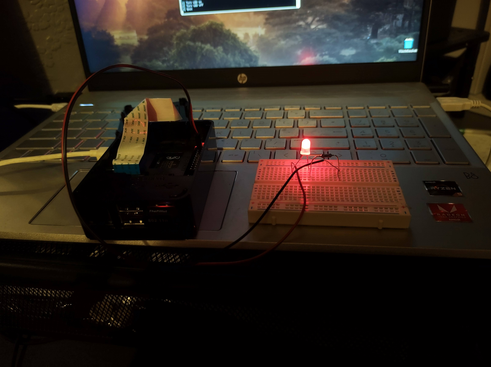

# Week 8
## Plan
- Turn an LED on and off using C++
## Work Done
- With 2 jumper wires, a 220Ω resisor, an LED and a breadboard, I created a circuit similar to this:

    

- I then wrote the code in C++ to turn the LED on and off here is it working:

    
    

## What I learnt
- Writing to files
- Creating a simple circuit
- Images in markdown (This file)